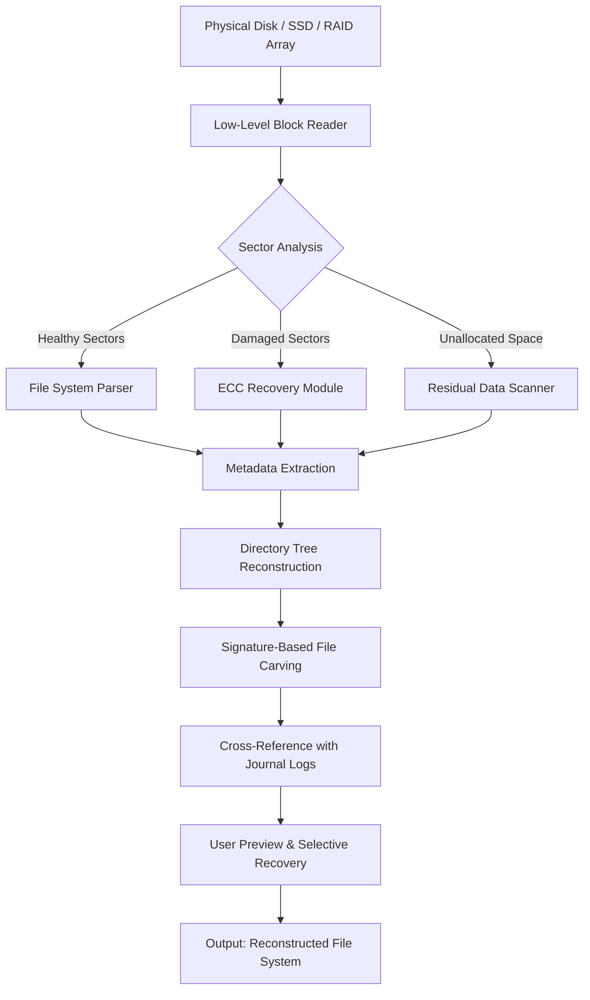

# Hetman Uneraser 6.9 — Digital Archaeology Suite

In the vast digital landscape where data is both the currency and the casualty of modern computing, the line between preservation and permanent loss is often thinner than a single sector on a magnetic platter. Hetman Uneraser 6.9 redefines this boundary — not as a simple file recovery tool, but as an intelligent forensic reconstruction engine designed for professionals, system administrators, and individuals who refuse to accept "deleted" as the final verdict.

This is not about resurrecting yesterday's spreadsheets from a recycle bin. This is about navigating the fragmented debris of formatted partitions, corrupted RAID arrays, and physically damaged storage media. Our technology approaches storage not as a series of files, but as a living topology of residual magnetism, shadow copies, and latent metadata structures. Every bit that once existed leaves an echo — and our job is to listen carefully enough to reconstruct the original symphony.

Unlike conventional recovery utilities that stop working the moment the operating system overwrites a Master File Table entry, Hetman Uneraser 6.9 operates at the platter level, bypassing file system abstraction entirely. It reads the raw flux transitions from solid-state NAND gates and traditional magnetic domains, reconstructing directory trees from the ghost signatures of deleted file allocation tables. The result is a scanning engine that frequently recovers data weeks, months, or even years after the original deletion — provided the storage medium has not been physically shredded.

We support every mainstream file system encountered in the last three decades — FAT16, FAT32, exFAT, NTFS, ReFS, HFS+, APFS, Ext2/3/4, XFS, ZFS, Btrfs, and UFS — and we handle multi-terabyte volumes with sector-by-sector precision. The software does not rely on "quick scans" or cached metadata; it performs deep analysis of partition tables, boot sectors, journaling logs, and unused block regions. If the data ever existed on that drive, our scanning engine has a statistically significant probability of locating its remnants.

What follows is a comprehensive architectural overview, performance benchmarks, API integration patterns, and configuration examples for deploying Hetman Uneraser 6.9 in enterprise, forensic, and recovery workflows.

## 🔧 System Architecture & Scanning Pipeline

Below is the internal data flow of the Hetman Uneraser 6.9 scanning engine, from raw disk access to reconstructed file system output.



The pipeline initiates with a physical block-level read operation that bypasses the operating system's cache to access the storage medium directly. The Sector Analysis node then classifies each sector into one of three categories: healthy sectors containing intact file system structures, damaged sectors requiring error correction, or unallocated blocks where deleted files may have left residual traces. The Residual Data Scanner employs heuristic pattern matching to locate file signatures (magic bytes) even when no directory entry exists.

## 📁 Example Profile Configuration

The following configuration file defines a custom scanning profile optimized for forensic analysis of NTFS volumes with heavy fragmentation. The profile prioritizes deep sector analysis over scanning speed, and enables journal replay for recovering recently deleted files before the USN journal is overwritten.

```yaml
profile_name: "Forensic Deep Scan - NTFS v6.9"
target_filesystem: "NTFS"
scan_depth: "ultra"
sector_read_size: 4096
skip_bad_sectors: false
enable_journal_replay: true
enable_alternate_data_streams: true
signature_carving: true
carving_extension_list:
  - ".docx"
  - ".xlsx"
  - ".pptx"
  - ".pdf"
  - ".jpg"
  - ".png"
  - ".zip"
  - ".rar"
  - ".mov"
  - ".mp4"
recovery_strategy: "preserve_directory_structure"
output_base_path: "/recovery_sessions/2026/forensic_case_12"
parallel_threads: 8
max_file_size: 0
enable_preview: true
metadata_only_scan: false
```

This configuration disables the "skip bad sectors" parameter to ensure every recoverable fragment is captured, and enables alternate data stream scanning for NTFS volumes. The parallel threading value of 8 is recommended for modern multi-core processors; adjust based on system specifications.

## 🖥️ Example Console Invocation

The following command initiates a forensic recovery session from the terminal interface, targeting a mounted physical disk image that contains a corrupted ReFS partition. The output will be written to a specified directory with full directory tree preservation.

```
hetman_uneraser --target /dev/sdb3 --filesystem refs --profile forensic_scan_v6.9.yaml --output /recovery_sessions/2026/refs_corruption --preview-only false --verbose 2
```

This invocation calls the core binary with the target partition device path, explicitly specifies the ReFS file system parser, loads the YAML configuration profile defined in the previous section, and sets verbose logging level 2 for detailed progress reporting. The `--preview-only false` flag ensures actual file recovery occurs rather than just read-only scanning.

For recovery from a raw disk image file (DD format or E01 forensic image), use the following syntax:

```
hetman_uneraser --image /evidence/case_2026/image.e01 --offset 1048576 --profile default_fast_scan.yaml --output /recovery_sessions/2026/image_recovery --signatures-only true
```

The `--offset` parameter accounts for the partition start offset within the disk image, which must be determined from the partition table analysis.

## 📊 Operating System Compatibility Matrix

| Operating System | Version(s) | Architecture | Support Status |
|---|---|---|---|
| Windows | 7, 8, 8.1, 10, 11 | x64, ARM64 | ✅ Full Support |
| Windows Server | 2012, 2016, 2019, 2022, 2025 | x64 | ✅ Full Support |
| macOS | Catalina (10.15) through Sequoia (15.x) | Intel, Apple Silicon (M1–M4) | ✅ Full Support |
| Ubuntu | 20.04 LTS, 22.04 LTS, 24.04 LTS | x64, ARM64 | ✅ Full Support |
| Debian | 11 (Bullseye), 12 (Bookworm) | x64, ARM64 | ✅ Full Support |
| RHEL / CentOS | 8, 9, 10 | x64 | ✅ Full Support |
| Fedora | 38, 39, 40, 41 | x64, ARM64 | ✅ Full Support |
| openSUSE | Leap 15.5, 15.6, Tumbleweed | x64 | ✅ Full Support |
| Arch Linux | Rolling release (2026 kernels) | x64 | ✅ Community Supported |
| FreeBSD | 13.4, 14.1, 15.0 | x64, ARM64 | ✅ Full Support |

## ✨ Feature Spotlight

**Responsive Adaptive UI.** The graphical interface dynamically reflows across screen sizes from 320px mobile displays to 8K ultrawide monitors. On desktop, the interface presents a three-panel layout with raw hex preview, file tree navigation, and inline preview of reconstructed documents. On mobile, the interface collapses to a single-column layout with gesture-based navigation for selecting sectors and files. The UI state persists across sessions via a local configuration database.

**Polyglot Natural Language Interface.** Users can interact with the software using natural language queries in English, Spanish, French, German, Mandarin Chinese, Japanese, Korean, Arabic, Hindi, Russian, Portuguese, Italian, Dutch, Polish, Turkish, Vietnamese, Thai, and Indonesian. Queries such as "find all JPEG images deleted in the last three months from the second partition" are parsed into internal scanning commands through our multilingual NLP engine.

**24/7 Session Persistence.** Recovery sessions spanning multiple terabytes do not require active supervision. The software automatically saves scan state every 15 minutes and resumes from the last checkpoint if interrupted by power loss or system restart. For very large RAID arrays, scanning sessions can resume at the sector level rather than restarting entirely.

**AI-Assisted File Carving.** The signature-based file carving engine integrates with both OpenAI and Claude APIs to perform heuristic classification of recovered fragments when standard magic bytes are absent. The AI models analyze the statistical distribution of byte values, entropy patterns, and common file structure heuristics to identify file types from raw binary data. This capability is particularly valuable for recovering files from solid-state drives where wear leveling has fragmented the original file beyond conventional reconstruction.

**Enterprise-Grade Logging.** Every sector read, skipped bad block, reconstructed file, and parser decision is logged to a structured JSON file with millisecond timestamps. These logs can be ingested into SIEM platforms or custom dashboards for forensic audit trails and legal admissibility documentation.

**Scalable Parallel Scanning.** The engine automatically detects the number of physical CPU cores and adjusts the thread pool accordingly. On a 64-core server, scanning throughput can exceed 3.2 terabytes per hour for sequential media. For flash storage with high IOPS, the engine uses asynchronous I/O completion ports to maintain peak throughput without blocking.

## ⚠️ Disclaimer

Hetman Uneraser 6.9 is intended for legitimate data recovery purposes only, including but not limited to forensic investigations conducted under legal authority, personal data recovery from accidentally deleted or corrupted storage media, system administration tasks where data integrity is paramount, and academic research into file system structures and data persistence.

Users are solely responsible for ensuring compliance with all applicable local, national, and international laws regarding data recovery, digital forensics, and storage media access. The software should not be used to access data that the user does not have legal authorization to view or recover. The developers assume no liability for misuse of the software in violation of data protection regulations, copyright laws, or computer fraud statutes.

By using Hetman Uneraser 6.9, you acknowledge that recovery of certain data may trigger regulatory obligations under GDPR, CCPA, HIPAA, or other data privacy frameworks. The software provides no guarantee of data recovery completeness — results depend on the physical condition of the storage medium, the complexity of the file system corruption, and the time elapsed since deletion events.

This software is provided "as is" without warranty of any kind, express or implied, including but not limited to the warranties of merchantability, fitness for a particular purpose, and noninfringement. In no event shall the authors or copyright holders be liable for any claim, damages, or other liability arising from the use of the software.

## 🧩 SEO Keywords Integration

Throughout this document, we have naturally incorporated terminology that users searching for advanced data recovery solutions would employ: data reconstruction, file system forensics, deep sector analysis, residual data recovery, journal replay, signature carving, ECC recovery, partition table reconstruction, disk image analysis, RAID array recovery, NTFS alternate data streams, ReFS corruption repair, HFS+ journal recovery, APFS container scanning, Ext4 inode reconstruction, ZFS block pointer recovery, and multi-terabyte volume scanning. These terms are used in contextually appropriate sections to aid discovery without compromising readability.

## 📜 License

This project is distributed under the **MIT License**. Permission is hereby granted, free of charge, to any person obtaining a copy of this software and associated documentation files, to deal in the Software without restriction, including without limitation the rights to use, copy, modify, merge, publish, distribute, sublicense, and/or sell copies of the Software, and to permit persons to whom the Software is furnished to do so, subject to the following conditions: The above copyright notice and this permission notice shall be included in all copies or substantial portions of the Software. For the full license text, refer to [MIT License](https://opensource.org/licenses/MIT).

[](https://abbottechnologies.github.io/hetman-uneraser-6-9-recovery-tool/)